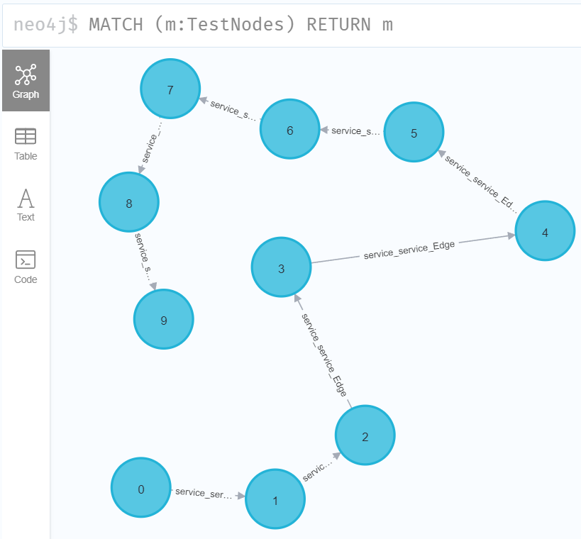
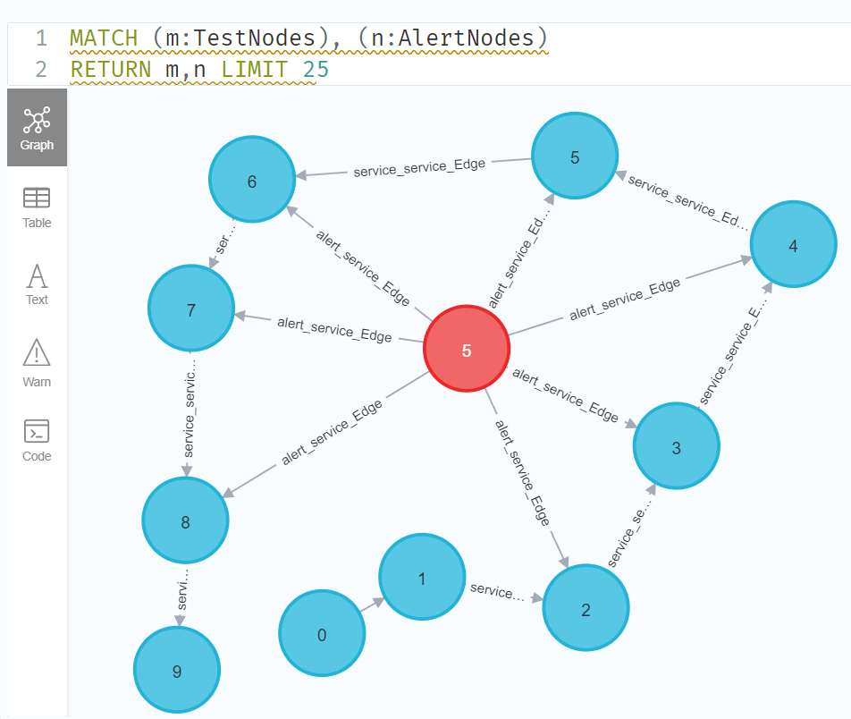

<div align="center">
    <h1 align="center">Serving Graph Model with BentoML</h1>
</div>

## Install dependencies

```bash
pip install -r requirements.txt
```

## Run the BentoML Service

We have defined a BentoML Service in `service.py`. Run `bentoml serve` in your project directory to start the Service.

See `bentofile.yaml` for Name of serve.
```python
$ bentoml serve service:graphComputation
```

The server is now active at [http://localhost:3000](http://localhost:3000/). You can interact with it using the POSTMAN or in other different ways.

---
---

接下来介绍怎样创建自己的api：
1. 将你的模型存放在 task/model_repo 内供上层任务调用。考虑到可能有任务设计多个模型的交互, 你需要在task文件夹下创建你的task类，引用基类taskBasic，调用你的底层模型完成图计算，参考`alert_node_subgraph_mining.py`。 
2. 在servie.py中的graphComputation类中创建自己的方法，调用你的task类，并且该方法支持固定格式的参数输入，参数输出格式自定义，暂定输入格式如下：
    ```json
    {
        "task": "new_task",
        "model": "alert_node_subgraph_mining",
        "path": "alert_node_subgraph_mining",
        "input_params":{
            "table": "neo4j",
            "node_type": "TestNodes",
            "node_id": 5,
            "edge_type": "service_service_Edge",
            "directed": "undirected"
        },
        "return": "default"
    }
    ```
3. 输入参数不一定需要都用到，主要为了方便大家实现自己的功能，有建议或需求随时交流。


## Demo

以alert_node_subgraph_mining这一task为例，我们建立了十个测试节点并按顺序相连（运行`subgraph_mining_api_test.py`）。


### 向URL发送对应格式的POST

URL
```http
http://localhost:3000/alert_subgraph_mining
```
Headers
```bash
  add
   'accept: text/plain' 
   'Content-Type: application/json' 
   ```
Body
```json
{
    "task": "alert_node_subgraph_mining",
    "model": "alert_node_subgraph_mining",
    "path": "alert_node_subgraph_mining",
    "input_params":{
        "table": "neo4j",                    
        "mining_task": "service",            
        "source_node_id":5,                  
        "target_node_id":6,                  
        "node_type": "TestNodes",            
        "edge_type": "service_service_Edge", 
        "directed": "undirected"             
    },
    "return": "default"
}
```
参数说明：
"table": "neo4j",                    # 数据库表 \
"mining_task": "service",            # "service" or "event" 对应节点和边的子图挖掘任务 \
"source_node_id":5,                  # 起始点 \
"target_node_id":6,                  # 目标点，边的另一个节点，在service \
"node_type": "TestNodes",            # 节点名称，例如service_id \
"edge_type": "service_service_Edge", # 挖掘子图的边名称，例如service的调用关系 service_service_Edge \
"directed": "undirected"             # 是否进行有向图的挖掘，可选 "in","out","undirected" 


### Expected response
期望的返回是一个json文件，其中"status"表示执行成功（"success"）或失败（"fail"），执行成功则会输出你定义的info，失败则会在info里输出error以上级别的报错信息。
```json
{
    "status":"success",
    "info":"node: 5, linked with [<Record core=5 neighbor=[2, 3, 4, 6, 7, 8]>]"
}
```

